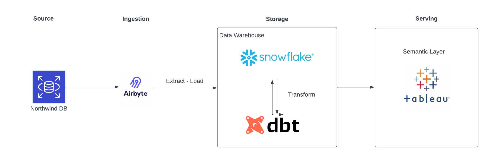

# Project plan 

## Objective 
The objective of our project is to create a scalable ETL pipeline that provides analytical datasets based on the Northwind Sales Database for Data Analysts to provide insights on sales performance and report trends to business stakeholders

## Consumers 
Data Analysts of the Sales Operations Team

## Questions 
What questions are you trying to answer with your data? How will your data support your users?

- Who are the best performing employees
- Who are our biggest customers
- How long does it take for us to ship our products
- 

Example: 

> - How many orders are there for each customer? 
> - What countries and regions have the most orders? 
> - What customers have their orders delayed? 
> - How many delayed orders are there for each country and region? 
> - How many orders do we have for each day? 
> - How many delayed orders do we have for each day? 

## Source datasets 
- Northwind Database (PostgreSQL Database)

## Solution architecture

